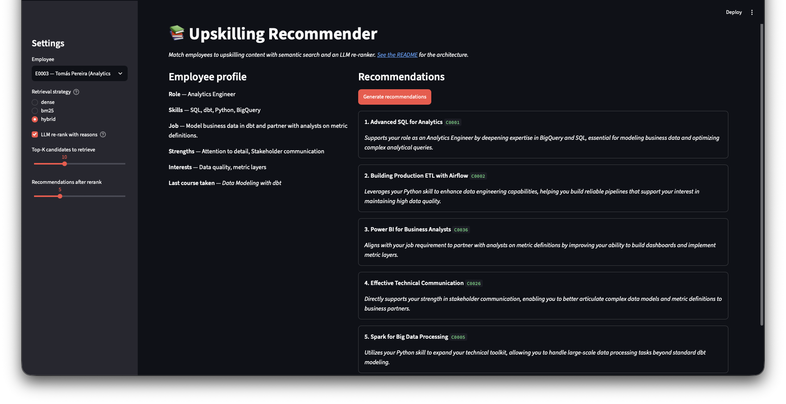

# Upskilling Recommender RAG

[](https://github.com/hayderalijaan/Upskilling-Recommender-RAG/actions/workflows/ci.yml)
[](LICENSE)
[](https://www.python.org/downloads/)

> Match employees to upskilling content with semantic search and an LLM re-ranker.

A retrieval-augmented generation pipeline that recommends learning content
(courses, videos, articles) to employees based on their skills, job description,
strengths, and interests. Built originally as the practical component of my
Master's thesis at a large industrial corporation; this public version uses
fully synthetic data and is structured for portfolio review.

---

## What it does

Given an employee profile like this:

```
role:            Data Engineer
skills:          Python, SQL, Airflow, ETL
job_description: Build and maintain batch and streaming pipelines feeding the
                 analytics warehouse.
strengths:       Reliability mindset, Systems thinking, Mentoring
interests:       Streaming systems, observability
```

it returns the top-5 most relevant learning items from the catalogue, each
with a short justification:

```json
[
  {
    "content_id": "C0004",
    "content_name": "Streaming Data with Kafka",
    "reason": "Directly supports the employee's interest in streaming systems and extends their ETL/Airflow skill set toward event-driven pipelines."
  },
  {
    "content_id": "C0010",
    "content_name": "Observability with OpenTelemetry",
    "reason": "Maps to the stated interest in observability and a Data Engineer's responsibility for pipeline reliability."
  }
]
```

## How it works

```
              ┌──────────────────────────────────────────────┐
              │       learning_content.csv (catalogue)       │
              │  id, name, description, keywords, skills...  │
              └──────────────────────┬───────────────────────┘
                                     │ ingest.py
                ┌────────────────────┴────────────────────┐
                ▼                                         ▼
      ┌──────────────────┐                       ┌──────────────────┐
      │  Dense:  FAISS   │                       │  Sparse:  BM25   │
      │  text-embedding- │                       │  (rank-bm25)     │
      │     3-small      │                       │                  │
      └────────┬─────────┘                       └────────┬─────────┘
               │  top-30 by cosine                        │  top-30 by BM25
               └────────────────────┬────────────────────┘
                                    ▼
                          ┌───────────────────┐
                          │   RRF fusion      │   ← --retriever hybrid
                          │   (c = 60)        │
                          └─────────┬─────────┘
                                    │  top-10 fused candidates
       employee profile ── query ───┤      (skills 2x weighted)
                                    ▼
                            ┌──────────────┐
                            │   LLM        │
                            │  re-ranker   │ →  top-5 JSON with reasons
                            │ (gpt-4o-mini)│
                            └──────────────┘
```

A `--retriever {dense,bm25,hybrid}` flag selects which retrieval strategy
runs upstream of the LLM. Hybrid is the recommended default for production
use; dense matches the original thesis baseline.

Design choices worth calling out:

1. **Hybrid retrieval via RRF.** BM25 catches exact lexical matches for
   rare technical terms ("Kubernetes", "dbt", "OpenTelemetry") that dense
   embeddings tend to smooth over; dense catches semantic matches BM25
   misses ("orchestration" ↔ "Airflow"). [Reciprocal Rank Fusion](https://plg.uwaterloo.ca/~gvcormac/cormacksigir09-rrf.pdf)
   combines their rankings robustly without needing score normalization.
2. **Skill-weighted query.** When constructing the query for an employee,
   the `skills` field is duplicated. In the thesis evaluation this small
   change reliably nudged the retriever toward skill-relevant content;
   for BM25 it boosts the term frequency of skill tokens, keeping signals
   aligned across both retrievers.
3. **LLM as re-ranker, not retriever.** Retrieval returns a shortlist of
   `k=10`; the LLM only re-ranks and explains. This keeps inference cost
   bounded by `k`, not by catalogue size, and lets the LLM give
   human-readable justifications that retrieval scores can't.

## Quick start

```bash
git clone https://github.com/hayderalijaan/Upskilling-Recommender-RAG.git
cd Upskilling-Recommender-RAG

python3 -m venv .venv && source .venv/bin/activate
pip install -r requirements.txt

cp .env.example .env
# edit .env to add your OPENAI_API_KEY

# (re)generate synthetic data — already committed, but you can regenerate
python scripts/generate_synthetic_data.py

# build the FAISS index from the catalogue
python scripts/build_index.py --reset

# produce recommendations for every employee (defaults to dense retrieval)
python scripts/recommend.py

# or use hybrid retrieval (BM25 + dense fused with RRF)
python scripts/recommend.py --retriever hybrid

# smoke-test on just one
python scripts/recommend.py --limit 1
```

Outputs land in `output/recommend_<employee_id>.json`.

## Configuration

All configuration is environment-driven via `.env`:

| Variable              | Default                    | Purpose                            |
| --------------------- | -------------------------- | ---------------------------------- |
| `OPENAI_API_KEY`      | _(required)_               | OpenAI API access                  |
| `CHAT_MODEL`          | `gpt-4o-mini`              | Re-ranker model                    |
| `EMBEDDING_MODEL`     | `text-embedding-3-small`   | Embedding model                    |
| `TEMPERATURE`         | `0.2`                      | Re-ranker sampling temperature     |
| `TOP_K`               | `10`                       | Candidates retrieved before rerank |
| `NUM_RECOMMENDATIONS` | `5`                        | Final results returned per user    |
| `DATA_DIR`            | `./data`                   | Where input CSVs live              |
| `INDEX_DIR`           | `./vector_store`           | Where the FAISS index is written   |
| `OUTPUT_DIR`          | `./output`                 | Where recommendations are written  |

## Project structure

```
Upskilling-Recommender-RAG/
├── data/                          # synthetic input data (committed)
│   ├── employees.csv
│   └── learning_content.csv
├── src/learning_rec/
│   ├── config.py                  # env-driven settings
│   ├── ingest.py                  # catalogue -> FAISS
│   ├── recommender.py             # retrieve(), rerank_with_llm(), recommend()
│   ├── prompts.py                 # LLM system prompts
│   ├── retrieval/
│   │   ├── base.py                # Retriever protocol + Candidate shape
│   │   ├── dense.py               # FAISS / OpenAI-embeddings retriever
│   │   ├── bm25.py                # in-memory BM25 retriever
│   │   ├── hybrid.py              # RRF fusion
│   │   └── factory.py             # build_retriever("dense"|"bm25"|"hybrid")
│   └── eval/
│       ├── ground_truth.py        # rule-based relevance labels
│       ├── metrics.py             # recall@k, MRR, precision@k
│       ├── judge.py               # LLM-as-judge
│       └── pipeline.py            # orchestrates an eval run
├── app/
│   └── streamlit_app.py           # interactive demo UI
├── scripts/
│   ├── generate_synthetic_data.py # rebuild the demo dataset
│   ├── build_index.py             # CLI for ingest
│   ├── recommend.py               # CLI for batch recommendations
│   └── run_eval.py                # CLI for evaluation
├── output/                        # recommendation JSON (gitignored)
├── vector_store/                  # FAISS artifacts (gitignored)
├── requirements.txt
├── .env.example
└── README.md
```

## Plugging in your own data

The pipeline doesn't know or care that the demo dataset is synthetic. Replace
the two CSVs with your own, keeping the columns:

- `learning_content.csv`: `content_id, content_name, content_description, content_language, duration_seconds, keywords, skills`
- `employees.csv`: `employee_id, name, role, skills, job_description, strengths, interests, last_course`

`keywords` and `skills` may be semicolon-separated, comma-separated, or
Python-literal lists — `ingest.to_list()` normalizes them.

## Evaluation

The eval harness measures the recommender at two stages independently:

- **Retrieval** — does the chosen retriever surface the relevant items at all?
  Metrics: `recall@10`, `precision@10`, `mrr@10`. Compare strategies with
  `--retriever {dense,bm25,hybrid}`.
- **End-to-end** — does the LLM rerank stage pick good items? Metric:
  `precision@5` against the ground-truth labels, plus an optional
  **LLM-as-judge** that rates each recommendation on a 4-point relevance scale.

**Ground truth** is rule-based: a course is "relevant" to an employee iff
their normalized skill sets share at least 2 elements (case-insensitive).
This is a *self-consistent benchmark* — it lets us compare retrieval methods
on the same yardstick, not an absolute relevance score. The threshold and
rationale are documented in [`src/learning_rec/eval/ground_truth.py`](src/learning_rec/eval/ground_truth.py).

```bash
# full eval: retrieval + rerank, no LLM judge
python scripts/run_eval.py

# cheap smoke run: 3 employees, retrieval only (skips chat-model calls)
python scripts/run_eval.py --limit 3 --no-rerank

# BM25 retrieval-only — fully offline, no OpenAI calls at all
python scripts/run_eval.py --retriever bm25 --no-rerank

# compare hybrid retrieval (BM25 + dense) end-to-end
python scripts/run_eval.py --retriever hybrid

# add LLM-as-judge (extra OpenAI calls)
python scripts/run_eval.py --judge
```

Outputs `output/eval_report.json` (full per-employee detail) and
`output/eval_summary.md` (paste-into-README summary).

## Results

> Baseline numbers from running `scripts/run_eval.py` against the synthetic
> dataset will be filled in here once the harness has been run end-to-end.
> Numbers shift slightly across LLM-rerank invocations because the chat
> model is sampled at `temperature=0.2`.

## Demo UI

A Streamlit app wraps the same pipeline so you can click through profiles
without touching a terminal. Pick an employee, choose a retriever
(`dense` / `bm25` / `hybrid`), toggle LLM re-ranking on or off, get
recommendations.

```bash
pip install -e ".[ui]"
streamlit run app/streamlit_app.py
```

Opens at <http://localhost:8501>. Picking **bm25** with **LLM re-rank
unchecked** runs the demo fully offline (no OpenAI calls).



> If the screenshot above is missing, run the app once and capture it —
> there's no committed image yet, just the placeholder.

## Development

```bash
pip install -e ".[dev]"   # includes the UI extra so all tests run

# lint
ruff check .

# tests (offline only — no API calls)
pytest -v
```

CI runs both on every push and PR; see [`.github/workflows/ci.yml`](.github/workflows/ci.yml).

## Origin

This project is an anonymized reimplementation of the practical component of
my Master's thesis. The original was developed against a corporate Learning
Experience Platform; this version replaces all proprietary data, paths, and
naming with synthetic equivalents. The recommender logic, prompt design, and
evaluation methodology are unchanged from the thesis.

## License

MIT — see [LICENSE](LICENSE).
